# 系统功能时序图

本文档基于当前项目代码整理，使用 Mermaid 时序图描述主要业务流程。

## 1. 用户注册与登录

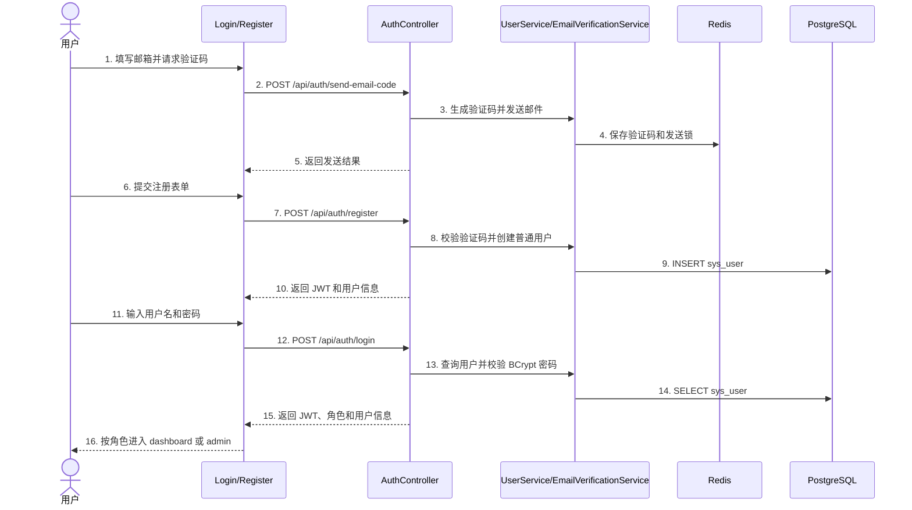

## 2. 数据采集

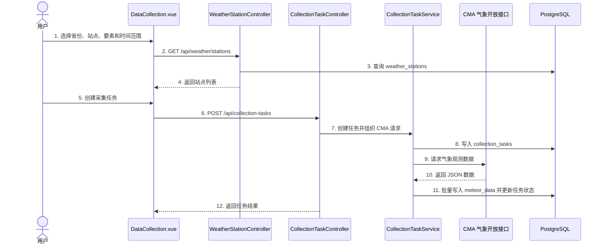

## 3. 统计分析

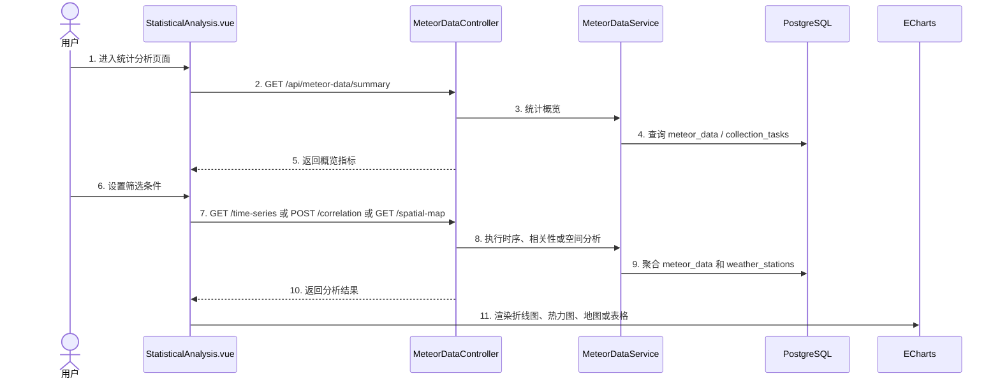

## 4. 普通用户报表导出

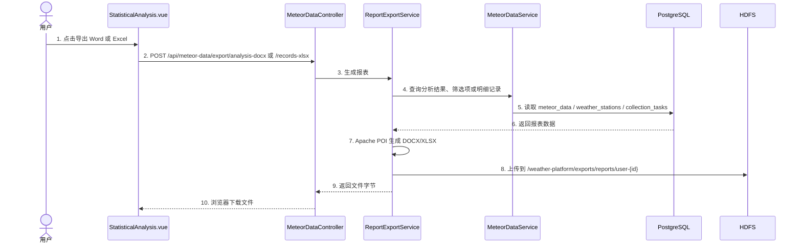

## 5. GIS 分析

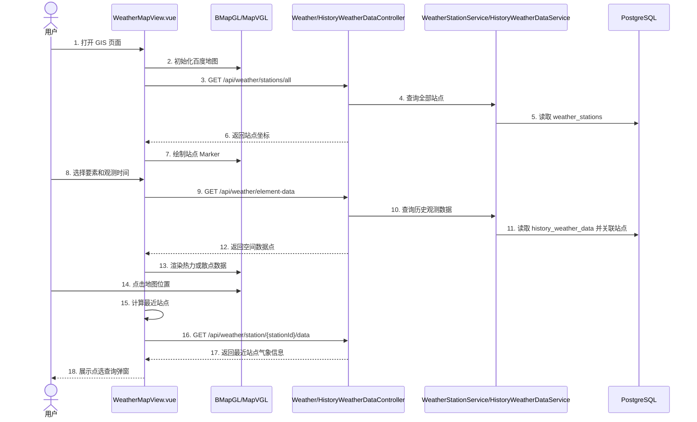

## 6. 数据预测

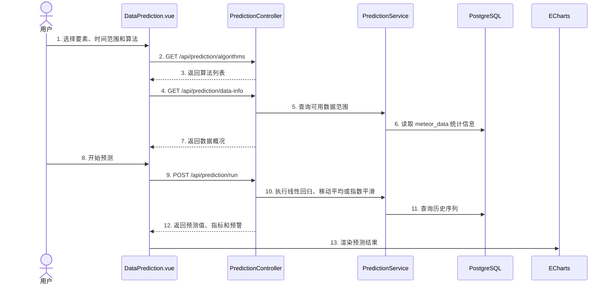

## 7. 个性化服务

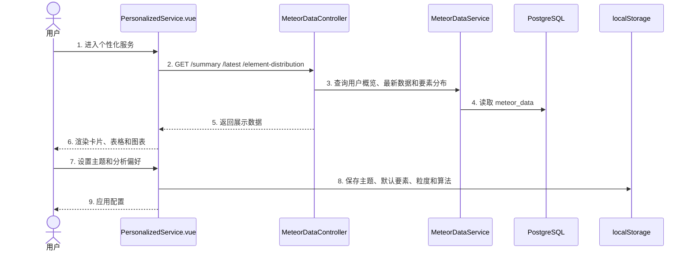

## 8. 管理员用户管理

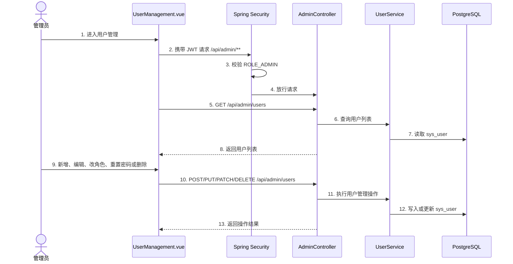

## 9. 管理员 HDFS 存储管理

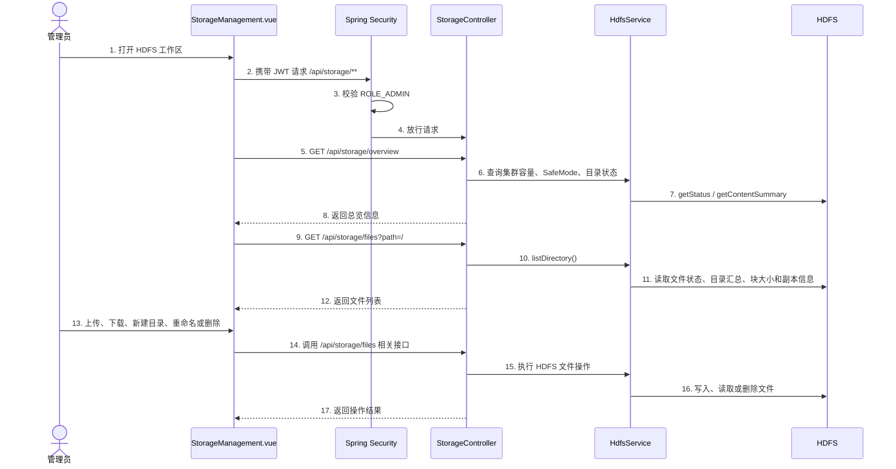

## 10. 管理员 GIS 数据上传到 HDFS

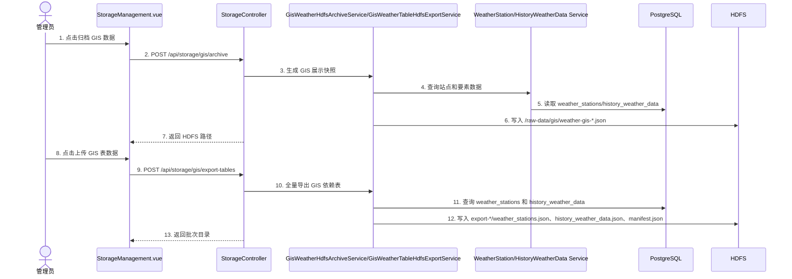

## 11. 管理员 Redis 缓存管理

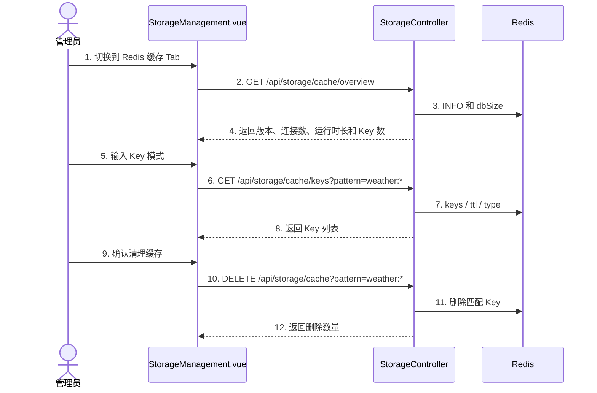

## 覆盖功能

| 功能 | 对应章节 |
|---|---|
| 用户注册登录 | 第 1 节 |
| 气象数据采集 | 第 2 节 |
| 统计分析 | 第 3 节 |
| 普通用户报表导出 | 第 4 节 |
| GIS 分析 | 第 5 节 |
| 数据预测 | 第 6 节 |
| 个性化服务 | 第 7 节 |
| 管理员用户管理 | 第 8 节 |
| 管理员 HDFS 管理 | 第 9 节 |
| GIS 数据上传 HDFS | 第 10 节 |
| Redis 缓存管理 | 第 11 节 |

文档更新时间：2026-05-16。
